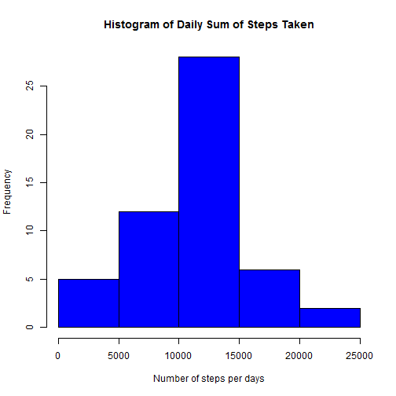
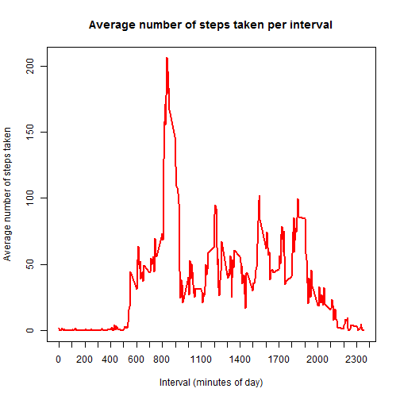
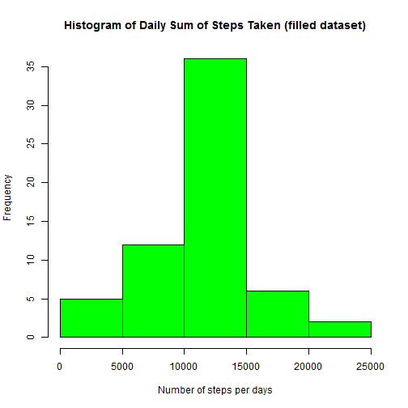

# Analysis of data from a personal activity monitoring device

## Introduction
It is now possible to collect a large amount of data about personal movement using activity monitoring devices such as a Fitbit, Nike Fuelband, or Jawbone Up. These type of devices are part of the "quantified self" movement - a group of enthusiasts who take measurements about themselves regularly to improve their health, to find patterns in their behavior, or because they are tech geeks. But these data remain under-utilized both because the raw data are hard to obtain and there is a lack of statistical methods and software for processing and interpreting the data.

This assignment makes use of data from a personal activity monitoring device. This device collects data at 5 minute intervals through out the day. The data consists of two months of data from an anonymous individual collected during the months of October and November, 2012 and include the number of steps taken in 5 minute intervals each day.

## Set global options and load packages

```r
knitr::opts_chunk$set(echo = TRUE) # Set global default to echo code
library(lattice);library(dplyr)
```

## Load and preprocess the data

The variables included in this dataset are:
- **steps**: Number of steps taking in a 5-minute interval (missing values are coded as NA)
- **date**: The date on which the measurement was taken in YYYY-MM-DD format
- **interval**: Identifier for the 5-minute interval in which measurement was taken

Read the data and store it as dataframe 'data'

```r
data <- read.csv("activity.csv")
```


## What is the mean total number of steps taken per day?

Calculate the total number of steps taken per day (ignoring the missing values)

```r
sum_steps <- tapply(data$steps, data$date, sum)
```

Make a histogram of the total number of steps taken each 

```r
hist(sum_steps, col = "blue", xlab = "Number of steps per days", ylab = "Frequency", main = "Histogram of Daily Sum of Steps Taken")
```

 

Calculate and report the mean and median of the total sum of steps taken per day

```r
meansteps <- as.character(mean(sum_steps, na.rm = TRUE))
mediansteps <- median(sum_steps, na.rm = TRUE)
```
The mean sum of steps taken per days is **10766.1886792453** and the median sum of steps taken per day is **10765**.


## What is the average daily activity pattern?

Calculate the number of steps taken per interval (averaged across all days) & make time series plot

```r
mean_interval <- tapply(data$steps, data$interval, mean, na.rm = TRUE)
plot(x=names(mean_interval),y=mean_interval, type = "l", xlab = "Interval (minutes of day)", ylab = "Average number of steps taken", col = "red", lwd = 2, main = "Average number of steps taken per interval", xaxt = "n")
axis(side=1, at = seq(0, 2400, by=100))
```

 

Determine which 5-minute interval, on average across all the days in the dataset, contains the maximum number of steps?

```r
maxinterval <- names(which.max(mean_interval))
```
The 5-minute interval which, on average across all the days, in the dataset, contains the maximum number of steps is **835**.


## Imputing missing values

Note that there are a number of days/intervals where there are missing values (coded as NA). The presence of missing days may introduce bias into some calculations or summaries of the data.

Calculate and report the total number of missing values in the dataset (i.e. the total number of rows with NAs)

```r
sumNAs <- sum(is.na(data$steps))
```
The total number of missing values in the dataset is **2304**.

Replace missing values (i.e. NAs) in steps with mean for that 5-minute interval, and create a new dataset that is equal to the original dataset but with the missing data filled in.

```r
filled <- data # new dataset that's filled in
for (i in seq_along(filled$steps)) {
    if(is.na(filled$steps[i])==TRUE) {
        replacement <- mean_interval[[ as.character(filled$interval[i]) ]]
        filled$steps[i] = replacement #7
    }
}
```

Make a histogram of the total number of steps taken each day and calculate and report the mean and median total number of steps taken per day. Do these values differ from the estimates from the first part of the assignment? What is the impact of imputing missing data on the estimates of the total daily number of steps?

```r
sum_steps.filled <- tapply(filled$steps, filled$date, sum)
hist(sum_steps.filled, col = "green", xlab = "Number of steps per days", ylab = "Frequency", main = "Histogram of Daily Sum of Steps Taken (filled dataset)")
```

 

```r
meansteps.filled <- as.character(mean(sum_steps.filled, na.rm = TRUE))
mediansteps.filled <- as.character(median(sum_steps.filled, na.rm = TRUE))
mean_diff <- as.numeric(meansteps.filled) - as.numeric(meansteps)
median_diff <- as.numeric(mediansteps.filled )- as.numeric(mediansteps)
if(mean_diff == 0) {
    text_mean <- "has no impact on"
}else if(mean_diff > 0) {
    text_mean <- "increases"
}else {
    text_mean <- "decrease"
}
if(median_diff == 0) {
    text_median <- "has no impact on"
}else if(median_diff > 0) {
    text_median <- "increases"
}else {
    text_median <- "decrease"
}
```
Using the filled dataset, the mean sum of steps taken per days is **10766.1886792453** and the median sum of steps taken per day is **10766.1886792453**.  
Imputing missing data **has no impact on** the mean value of the total daily number of steps.  
Imputing missing data **increases** the median value of the total daily number of steps.


## Are there differences in activity patterns between weekdays and weekends?

Using the dataset with the filled-in missing values, create a new factor variable in the dataset with two levels - "weekday" and "weekend" indicating whether a given date is a weekday or weekend day.

```r
for (i in seq_along(filled$date)) {
    if( weekdays(as.Date(filled$date[i])) == "Saturday" | weekdays(as.Date(filled$date[i])) == "Sunday") {
        filled$dayfactor[i] <- "weekend"
    } else {
        filled$dayfactor[i] <- "weekday"
    }
}
```

Make a panel plot containing a time series plot of the 5-minute interval and the average number of steps taken, averaged across all weekday days or weekend days.


```r
weekday <- filter(filled, dayfactor=="weekday")
weekend <- filter(filled, dayfactor=="weekend")
temp_weekday <- group_by(weekday, interval)
temp_weekend <- group_by(weekend, interval)
weekday.table <- summarize(temp_weekday, meansteps=mean(steps), dayfactor="weekday")
weekend.table <- summarize(temp_weekend, meansteps=mean(steps), dayfactor="weekend")
meanintervals.dayfactor <- rbind(weekday.table,weekend.table)
xyplot(meansteps~interval | as.factor(dayfactor),data=meanintervals.dayfactor,
       type="l", layout=c(1,2), xlab="Interval", ylab="Number of steps")
```

 
